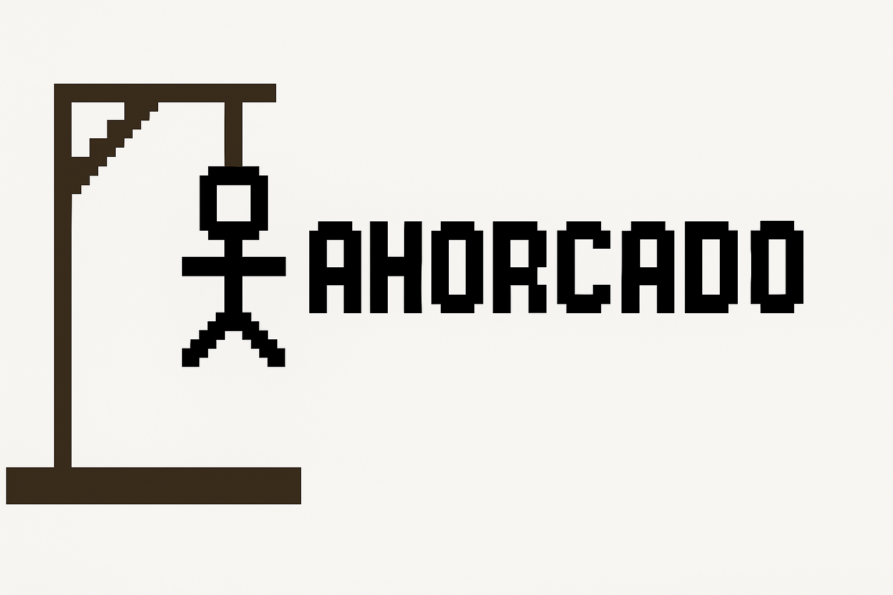

# 🪢 Juego del Ahorcado en Python

¡Bienvenido a este clásico juego del Ahorcado, programado en Python para consola!  
Pon a prueba tu vocabulario y lógica intentando adivinar la palabra oculta antes de quedarte sin intentos.

---



---

## 🎮 Cómo jugar

- El juego selecciona una palabra secreta al azar.
- Introduce letras para descubrir la palabra.
- Se mostrará tu progreso con guiones bajos y letras acertadas.
- Tienes un número limitado de intentos para adivinarla.

## 💻 Requisitos

- Python 3.x instalado en tu equipo.

## 🚀 Ejecutar el juego

Desde la terminal, en la carpeta del proyecto, ejecuta:

```bash
python ahorcado.py

## 👨‍💻 Autor

**David Suárez**  
[GitHub](https://github.com/scod01) • [LinkedIn](www.linkedin.com/in/davidsuarez-dev)
